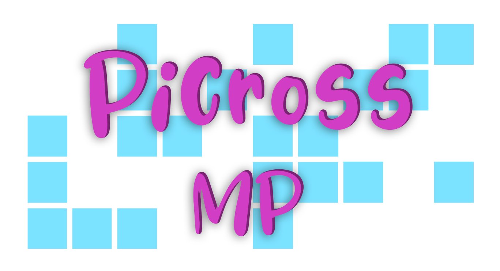

<!-- PROJECT LOGO -->
 

  

  <h3 align="center">Picross MP</h3>

  

    Picross MP is a multiplayer version of the lovely game Picross. 
     
     
    A web-version of the project to test it for yourself is available here:
     
    <a href="https://picross-mp.herokuapp.com">View Demo</a>
     
    (<i>the site might take a while to load, since the heroku container must start up</i>)
    <!-- <a href="https://github.com/github_username/repo_name"><strong>Explore the docs »</strong></a>
     
     
    
    ·
    <a href="https://github.com/github_username/repo_name/issues">Report Bug</a>
    ·
    <a href="https://github.com/github_username/repo_name/issues">Request Feature</a>-->
  

<!-- TABLE OF CONTENTS -->

<h2 style="display: inline-block">Table of Contents</h2>

  <ol>
    <li>
      <a href="#about-the-project">About The Project</a>
    </li>
    <li>
      <a href="#getting-started">Getting Started</a>
      <ul>
        <li><a href="#prerequisites">Prerequisites</a></li>
        <li><a href="#installation">Installation</a></li>
      </ul>
    </li>
    <!--<li><a href="#usage">Usage</a></li>-->
    <!--<li><a href="#contributing">Contributing</a></li>-->
    <li><a href="#license">License</a></li>
    <!-- <li><a href="#contact">Contact</a></li>-->
    <li><a href="#acknowledgements">Acknowledgements</a></li>
  </ol>
  
  
  ## About The Project
  
  Some time ago, a friend of mine and I got hooked on the famous game Picross. We used to exchange game seeds to play the same game and try to solve it as fast as possible. The first one to finish wins the round.
  
  This way of playing the game is quite cumbersome, so I had the idea to implement a version of the game that supports a few different multiplayer game modes.
  
  ### About Picross
  
  
  Picross is a game based on [Nonogram](https://en.wikipedia.org/wiki/Nonogram) puzzles, a form of logic puzzle in picture form.
  
  > Nonograms [...] are picture logic puzzles in which cells in a grid must be colored or left blank according to numbers at the side of the grid to reveal a hidden picture.
  >
  > -- <cite>https://en.wikipedia.org/wiki/Nonogram</cite>
  
  A really good Picross implementation for the web can be found at the following website (designed and written by Henry Liou): [Link](http://liouh.com/picross/).
  
  *(The screenshot on the right is taken by this version as well, all credits go to [Henry Liou](http://liouh.com/home/))*
  
  ### New Features
  - **Mobile friendly**: This version of the game is designed to be mobile friendly.
  - **Advanced gestures**: There are a few gestures, that improve the game a lot. For example, it is possible to mark/open multiple fields in a row by performing a dragging gesture with a single finger drag gesture. Scrolling/panning and zooming is performed by using two fingers (similarly to a pinch gesture). That way, the nightmare of accidentally opening fields while panning/zooming belongs to the past!
  - **Multiplayer**: The key point. I have a few ideas for different multiplayer game modes, but only the first one is implemented right now:
      - Both Players play the *same seed*, but each on their *own board*. The player's progress gets transmitted to the other. Areas that the other player has already solved correctly are marked by a little checkmark in the right corner of the cells. Mistakes are marked with a little red cross. This does not give away the solution (if the cell is filled or empty), it just displays the progress of the other player. This creates a lot more suspense while playing against each other since the progress is transmitted in real-time. The first one to finish wins the round.
      - Both players play on the same field - the first one to open a field correctly gets points (this could be problematic due to ping differences).
      - A player can play a (custom) seed and the time it took to solve gets recorded. He then can challenge others to beat his time by sending an invite, for example. 
  
  ### Backend
  For the multiplayer aspect (data synchronization), I implement a node.js server, that communicates with the clients via the WebSocket based library [socket.io](https://socket.io/).
  > Socket.IO enables real-time, bidirectional and event-based communication.
  > It works on every platform, browser or device, focusing equally on reliability and speed.
  
  I then designed a little protocol, that is state-based and (for the most part) request-response focused. Here is an overview of the different message types and their answers in form of a sequence diagram:
   
  
  
  ## Getting Started
  In progress...
  
  ## License
  See [LICENSE](LICENSE).
  
  ## Acknowledgements
  - [seedrandom.js](http://davidbau.com/archives/2010/01/30/random_seeds_coded_hints_and_quintillions.html) from [David Bau](http://davidbau.com/)
  - [array-flat-polyfill](https://github.com/jonathantneal/array-flat-polyfill) from [jonathantneal](https://github.com/jonathantneal)
  - [Socket.IO](https://socket.io/)
  - [jQuery](https://jquery.com/)
  - [Bootstrap](https://getbootstrap.com/)
